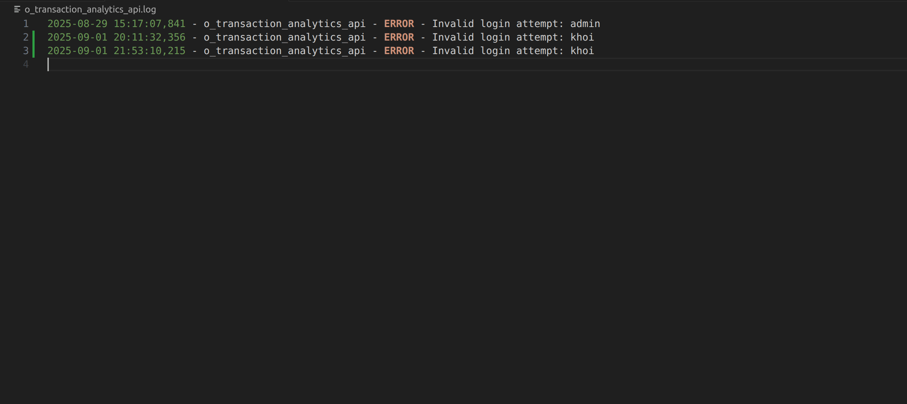

# E-Commerce Transaction Analytics Pipeline


 
 

A data pipeline for e-commerce transactions, built with **Python**, **DBT**, **MySQL**, **FastAPI**, and **Docker** to transform raw campaign data into business insights and fraud detection reports.
## Introduction of the Project and Overview of the Implementation Steps
### 📌 Introduction:
This project is a E-Commerce Transaction Analytics Pipeline designed to process and analyze e-commerce campaign data. The system transforms raw transaction logs into structured insights, such as customer spending, shop performance, and fraud detection. It also provides APIs for different stakeholders (customers, shop owners, and the marketing team) to access business metrics in real time.


### 📝 Context:
The dataset was collected from a discount campaign on an e-commerce platform, containing detailed transaction records during the event. The campaign ran for **4 days (2019-10-30 to 2019-11-02)**, where each user received **one voucher per day** (30% off per order, capped at 20,000 VND).  
After gathering the campaign transaction data, the following steps were implemented:

### ⚙️ Overview of the Implementation Steps:
- Built MySQL database by using docker-compose.
- Used **DBT (Data Build Tool)** to process and transform data from the raw transaction table (tbl transaction_data):
    - Transformed into a table storing shop and shop owner information (**tbl dim_shop_owner**).
    - Transformed into a table storing customer information such as total spending, ranking, and classification (Gold, Silver, Bronze) (**tbl customer_pending_rank**).
    - Transformed into a table storing shop information such as total orders, GMV, shop ranking by orders and revenue, and classification (Gold, Silver, Bronze) (**tbl shop_selling_rank**).
    - Defined, detected, and stored customers and shops with potentially fraudulent transactions into two separate tables:
        - **tbl suspected_fraud_customers** (customer info and reasons for fraud suspicion).
        - **tbl suspected_fraud_shop** (shop info and reasons for fraud suspicion).
- Built an **API** to allow different users to access analytics:
    - For customers and shop owners: 
        - View total GMV, ranking, classification, and check whether they are flagged as suspicious (with reasons).
    - For Marcom staff: 
        - Log in with authorized credentials (username: admin, password: admin) to view campaign-level metrics such as total orders, GMV, number of vouchers used, as well as detailed customer/shop information similar to other users.
- Used **Docker** to containerize the API, ensuring stable and consistent deployment across environments while simplifying setup and scalability.

## Project Structure

```
E-Commerce-Transaction-Analytics-Pipeline/
│
├── _001_config/                          # Configuration files
│   └── _00101_database_config.py         # MySQL database connection configuration
│
├── _002_utils/                           # Utility modules
│   ├── api_authentication.py             # API authentication and authorization logic
│   └── logger.py                         # Logging utility for API access tracking
│
├── customer_online_transactions_analytics/ # DBT project directory
│   ├── dbt_project.yml                   # DBT project configuration
│   │
│   ├── models/                           # DBT models (SQL transformations)
│   │   ├── staging/                      # Staging layer models
│   │   │   ├── stg_transaction_data.sql  # Staging model for raw transaction data
│   │   │   └── schema.yml                # Schema definitions and tests for staging models
│   │   │
│   │   └── marts/                        # Marts layer models (final business tables)
│   │       ├── dim_shop_owner.sql        # Dimension table: shop and shop owner information
│   │       ├── customer_pending_rank.sql # Customer ranking and classification (Gold/Silver/Bronze)
│   │       ├── shop_selling_rank.sql     # Shop ranking and classification (Gold/Silver/Bronze)
│   │       ├── sale_analysis_by_shop_daily.sql # Daily sales analysis by shop
│   │       ├── suspected_fraud_customers.sql   # Fraud detection: suspicious customers
│   │       ├── suspected_fraud_shop.sql         # Fraud detection: suspicious shops
│   │       └── schema.yml                # Schema definitions and tests for marts models
│   │
│   ├── macros/                           # DBT macros (reusable SQL functions)
│   │   ├── positive_quantity.sql         # Macro to validate positive quantities
│   │   └── rank_category.sql             # Macro for ranking and categorization logic
│   │
│   ├── analyses/                         # Ad-hoc analysis queries
│   ├── seeds/                            # Seed data files (CSV)
│   ├── snapshots/                        # DBT snapshots for historical tracking
│   ├── tests/                            # Custom DBT tests
│   ├── target/                           # DBT compilation artifacts (generated)
│   └── logs/                             # DBT execution logs
│
├── data_sample/                          # Sample data files
│   └── transaction_data.csv              # Raw transaction data sample
│
├── image/                                # Documentation images
│   ├── overview.png                      # Project overview diagram
│   ├── api-docs.png                      # API documentation screenshot
│   └── ...                               # Other demo and documentation images
│
├── logs/                                 # Application logs
│   └── o_transaction_analytics_api.log   # API access and authentication logs
│
├── main.py                               # FastAPI application entry point
├── import_raw_data.py                    # Script to import raw data into MySQL
├── requirements.txt                      # Python dependencies
├── docker_compose.yml                    # Docker Compose configuration for MySQL
├── Dockerfile                            # Docker configuration for API containerization
└── README.md                             # Project documentation
```

### Key Components:

- **`_001_config/`**: Contains database connection settings and configuration files
- **`_002_utils/`**: Utility modules for authentication, logging, and helper functions
- **`customer_online_transactions_analytics/`**: DBT project with data transformation models
  - **`models/staging/`**: Raw data cleaning and standardization
  - **`models/marts/`**: Business-ready analytical tables
  - **`macros/`**: Reusable SQL macros for common transformations
- **`main.py`**: FastAPI application with endpoints for different user roles
- **`import_raw_data.py`**: Data ingestion script for initial data loading
- **`docker_compose.yml`**: MySQL database container setup
- **`Dockerfile`**: API containerization configuration

## Detailed Project Demo Guide

1. First, clone this repository from GitHub to your local machine. Next, create a new virtual environment to prepare for the demo. Note that the demo will be conducted on an ***Using Anaconda***. If you are working on a different operating system or environment, please please skip this step. 
```bash
# create evironment
conda create --name demo-01 python=3.10 -y ;
conda activate demo-01
```

2. Then, import the required libraries.
```bash
# import lib
pip install -r requirements.txt
```

3. Then, run docker-compose file to set up a MySQL database (version 8.0). Next, run the file import_raw_data.py to prepare raw data for demo (use DBeaver to check the inserted data)
```bash
# Run docker-compose file on terminal
docker-compose -f docker_compose.yml up -d ;

# Run file insert raw data to MySQL 
python import_raw_data.py
```

4. Connect to Mysql database by using DBeaver tools (connection information is in _00101_database_config.py file). Then, run code SQL to create schema data_mart (pass: 123)

```bash
# Code create schema data_mart
create database data_mart;
```


 **Note: while you are connecting MySQL by using DBeaver, Set up allowPublicKeyRetrieval = TRUE in "Driver properties"**


5. Open a new terminal, set the dbt profile configuration, and then run the following commands:
```bash
# Manually create the .dbt directory and set up profile.yml file
mkdir -p ~/.dbt;
# open folder dbt
cd ~/.dbt/ && code .
```

```bash
# create profile.yml and add this content into profile.yml
customer_online_transactions_analytics:
  outputs:
    dev:
      type: mysql
      server: localhost 
      port: 3307
      schema: data_mart  
      database: data_mart 
      username: root
      password: "123"
      driver: MySQL ODBC 8.0 ANSI Driver

    prod:
      type: mysql
      server: localhost
      port: 3307
      schema: data_mart
      database: data_mart
      username: root
      password: "123"
      driver: MySQL ODBC 8.0 ANSI Driver

  target: dev
```

6. Return to the original terminal and run the following commands:
```bash
cd customer_online_transactions_analytics ; ### Navigate to the folder where dbt is running.
dbt run
```
- If the output matches the example image, the execution was successful and you will see the newly created tables in MySQL.


7. Continue by running the commands to open the DBT docs, where you can review the logic used to create the tables (http://localhost:8080)
```bash
dbt docs generate;
dbt docs serve;
```


8. Next, run the commands to start FastAPI. You can open a separate terminal to enter the command or click "Ctrl + C" to continue this terminal. However, If you countinue to use this terminal, you must enter the command "cd .." before entering the below command
```bash
uvicorn main:app --host 0.0.0.0 --port 8000 --reload
```


- Copy the URL (http://localhost:8000/docs) and paste it into your browser.


- Click 'Try it out' and fill in the input to perform the search (for cases requiring login, use username = admin and password = admin).


- Note: Viewing the campaign summary is restricted to internal use (Marcom department), so a username and password are required. Any unauthorized login attempts with incorrect credentials will be logged in the file o_transaction_analytics_api.log




- All accesses to the API will be notified and logged.


- Additionally, we can use Postman as an alternative to accessing the link http://localhost:8000/docs


### ***Author: Nguyen Minh Khoi***